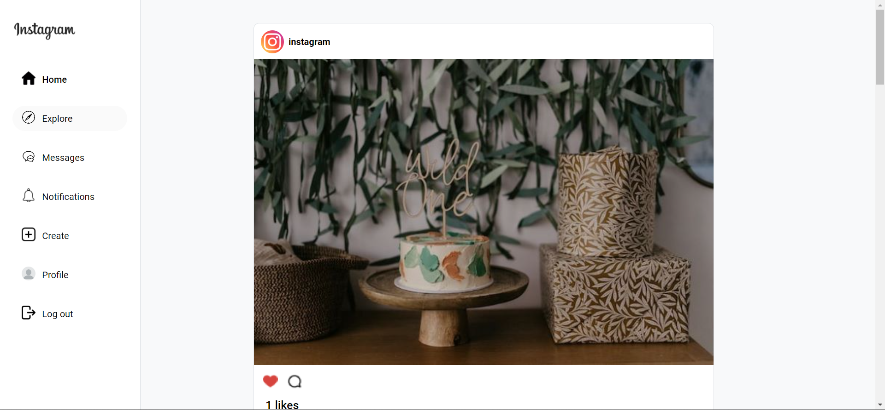

# Instagram Clone

This project is a clone of the popular photo sharing app Instagram. It is written in html, css and js. And the APIs where written in php.

## Features

- Users can sign up and login
- Users can upload photos and share them with other users
- Users can see their photos and others in their feed
- Users can like and comment on photos
- Users can find friends
- Users can talk to each other with our messaging feature
- Users can add, block and remove friends

## Stacks

 
 
 

## Getting Started

These instructions will get you a copy of the project up and running on your local machine for development and testing purposes.

### Prerequisites

- XAMPP
- Laravel

### Setting up the website

- Download an set up XAMPP on your pc.
- Clone this repository to the `htdocs` directory in XAMPP
- Open phpmyadmin and create a database call `instagramdb`
- Open your terminal, navigate to api folder and run `php artisan migrate` and then run `php artisan serve`
- Open your browser to the localhost website

## Screenshots

